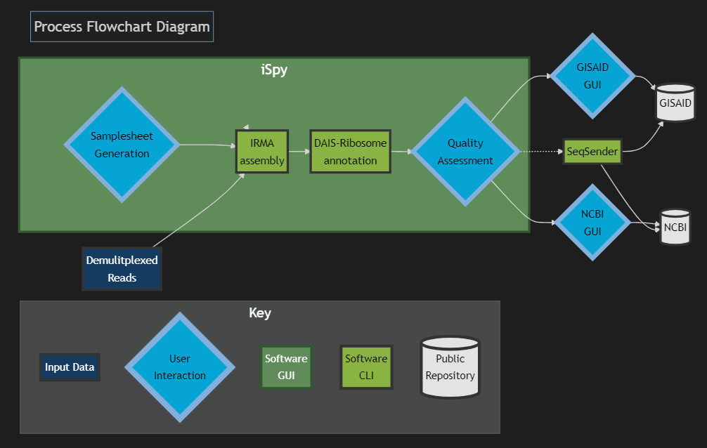

# Interactive Dashboard for Influenza Genome and SARS-CoV-2 Spike-Gene Assembly and Curation

Version: 1.0.0 (Beta)

**Beta version** This pipeline is currently in Beta testing and issues
could appear during submission, use at your own risk. Feedback and
suggestions are welcome!

**General disclaimer** This repository was created for use by CDC
programs to collaborate on public health related projects in support of
the [CDC mission](https://www.cdc.gov/about/organization/mission.htm).
GitHub is not hosted by the CDC, but is a third party website used by
CDC and its partners to share information and collaborate on software.
CDC use of GitHub does not imply an endorsement of any one particular
service, product, or enterprise.

# Overview

**iSpy** is an interactive dashboard created using **Dash**, a python framework
written on the top of **Flask**, **Plotly.js** and **React.js**. The dashboard
allows users to interactively create a metadata and config file for
Influenza Genome and SARS-CoV-2 Spike-Gene Assembly. Subsequently, it
will generate the files necessary to upload via FTP to NCBI’s databases
**Genbank**, **BioSample**, and **SRA**, as well as **GISAID**.

Below is a flowchart diagram that illustrates the process of Influenza genome and SARS-CoV-2 spike-gene assembly and curation. In generality, the process starts with demultiplexed sequencing reads from an Illumina or Oxford Nanopore Technologies sequencer and finish with high quality genomes ready for submission to public repositories.

# Contents
- [Dockerize iSpy](#docker)
- [Running iSpy with Docker-Compose](#docker-compose)
- [NGS Training](#ngs-training)

